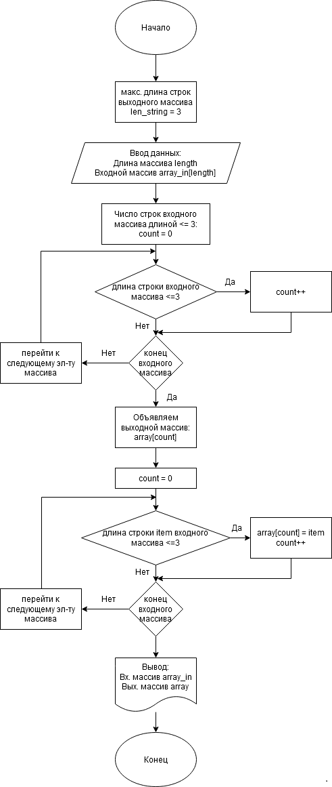

# I Четверть. Итоговая работа
Программа из начального массива строк формирует новый массив из строк, длина которых меньше либо равна 3 символам.

**
Блок-схема решения задачи
**

Для демонстрации применения различных конструкций языка C# решение реализовано в виде 4-х ***функций*** (как возвращающих, так и не возвращающих значения):

1. **InputArray()** - функция формирования входного (начального) массива строк произвольной длины. Размер массива и затем его элементы задаются пользователем путем ввода значений с клавиатуры. Возвращает массив строк;
2. **CountNeedItems()** - функция производит подсчет строк во входном массиве, длина которых меньше, либо равна 3. Возвращает целое число - количество таких строк. Это значение используется для определения размера и инициализации выходного массива;
3. **FillOutputArray()** - функция формирования выходного массива из входного, элементами которого являются строки входного массива длиной меньше либо равной 3 символам. Возвращает массив.
4. **PrintArray()** - функция печати массива любой длины в консоль.

Для наглядности в программе реализованы 3 цикла: *for*, *foreach* и *while*.

Для устранения магического числа "3" введена переменная *len_string*, изменяя значение которой можно изменять ограничение длины искомых строчных элементов входного массива.
